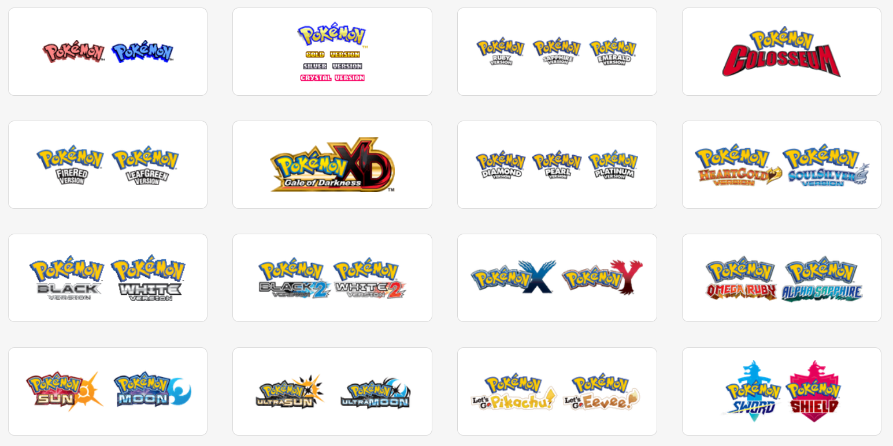

# Pokémon Team Planner

A comprehensive web-based tool designed to help Pokemon trainers plan and build their perfect team for any mainline Pokemon game. This repository contains the source code for the Pokemon Team Builder application.

**🌐 Live Website: [pokemon team builder/](https://pokemonteambuilder.pro/)**

Visit the live website above to start building your Pokemon team immediately - no setup required!



## Overview

The Pokemon Team Builder is a comprehensive web-based tool designed to help Pokemon trainers plan and build their perfect team for any mainline Pokemon game. Whether you're preparing for a casual playthrough or optimizing your team composition, this builder provides all the tools you need to create a balanced and effective Pokemon team.

### Supported Games

Our team builder supports all mainline Pokemon games from Generation 1 through Generation 9, including:

- Classic titles: Red, Blue, Yellow, Gold, Silver, Crystal
- Advance generation: Ruby, Sapphire, Emerald, FireRed, LeafGreen
- DS era: Diamond, Pearl, Platinum, HeartGold, SoulSilver, Black, White, Black 2, White 2
- 3DS era: X, Y, Omega Ruby, Alpha Sapphire, Sun, Moon, Ultra Sun, Ultra Moon
- Switch titles: Let's Go Pikachu/Eevee, Sword, Shield, Brilliant Diamond, Shining Pearl, Legends: Arceus, Scarlet, Violet, Legends: Z-A
- Special titles: Colosseum, XD: Gale of Darkness, Pokemon HOME


## Key Features

### 🎯 Comprehensive Game Support
- Complete Pokedex data for each supported game
- Version-exclusive Pokemon filtering
- Support for all regional dexes

### 🔍 Advanced Filtering System
Filter Pokemon by multiple criteria:
- **Type Filter** - Filter by Pokemon type or exclude specific types
- **Generation Filter** - Show only Pokemon from specific game generations
- **Version Filter** - See version-exclusive Pokemon
- **Evolution Stage** - Filter by fully evolved, not fully evolved, or Mega Evolution forms
- **Category Tags** - Filter by Non-Legendary, Sub-Legendary, Legendary, or Mythical Pokemon
- **Characteristics** - Filter by color, shape, or experience group
- **Search Bar** - Quickly find specific Pokemon by name

### 📊 Intelligent Type Analysis
- **Team Defense** - Automatically calculates your team's weaknesses (red marks) and resistances (blue marks)
- **Coverage (STAB)** - Shows which types your team can effectively counter with Same-Type Attack Bonus moves
- Visual indicators make it easy to spot problematic type matchups at a glance
- Hover over tally marks to see which Pokemon contribute to each type interaction

### ✨ Special Forms Support
- **Mega Evolution** - Available for Generations 6-7 games
- **Gigantamax** - Available for Sword and Shield teams
- **Terastallization** - Available for Scarlet and Violet teams
- Gender variants, shiny forms, and special battle forms


### 🔗 Easy Sharing
- Share your team plans with one click via URL
- No registration or account creation required
- Complete team configuration saved directly in the URL
- Works across all devices - desktop, tablet, and mobile

### 🎲 Additional Tools
- **Randomize Team** - Randomly select Pokemon from available options
- **Toggle Advanced Options** - Customize your view
- **Special Form Toggles** - Switch between variants and forms

## What Problems Does It Solve?

Building an effective Pokemon team can be challenging. This tool helps with:

- **Type Weaknesses and Resistances** - Automatic type analysis highlights potential vulnerabilities and strengths
- **Version-Exclusive Pokemon** - Filter Pokemon based on your specific game version
- **Team Diversity** - Ensure type balance and prevent overlapping weaknesses
- **Time Management** - Quickly browse and compare hundreds of Pokemon without manual research
- **Team Sharing** - Share your planned team via URL for discussion and feedback
- **Special Form Considerations** - Access information about Mega Evolution, Gigantamax, and Terastallization

## Deployment

This is a static website that can be deployed to any static hosting service. Here are some simple deployment options:

### Option 1: GitHub Pages
1. Push this repository to GitHub
2. Go to Settings > Pages
3. Select your source branch
4. Your site will be live at `https://yourusername.github.io/pokemon-team-planner/`

### Option 2: Netlify
1. Install Netlify CLI: `npm install -g netlify-cli`
2. Run: `netlify deploy --prod`
3. Your site will be automatically deployed

### Option 3: Vercel
1. Install Vercel CLI: `npm install -g vercel`
2. Run: `vercel`
3. Follow the prompts to deploy

### Option 4: Simple HTTP Server
For local development or testing:
```bash
# Python 3
python -m http.server 8000

# Node.js
npx http-server

# Then visit http://localhost:8000
```

## Technical Details

- **Pure HTML/CSS/JavaScript** - No build step required
- **No Dependencies** - Runs entirely client-side
- **Responsive Design** - Works on all devices
- **Offline Capable** - Can be used without internet once loaded

